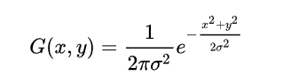
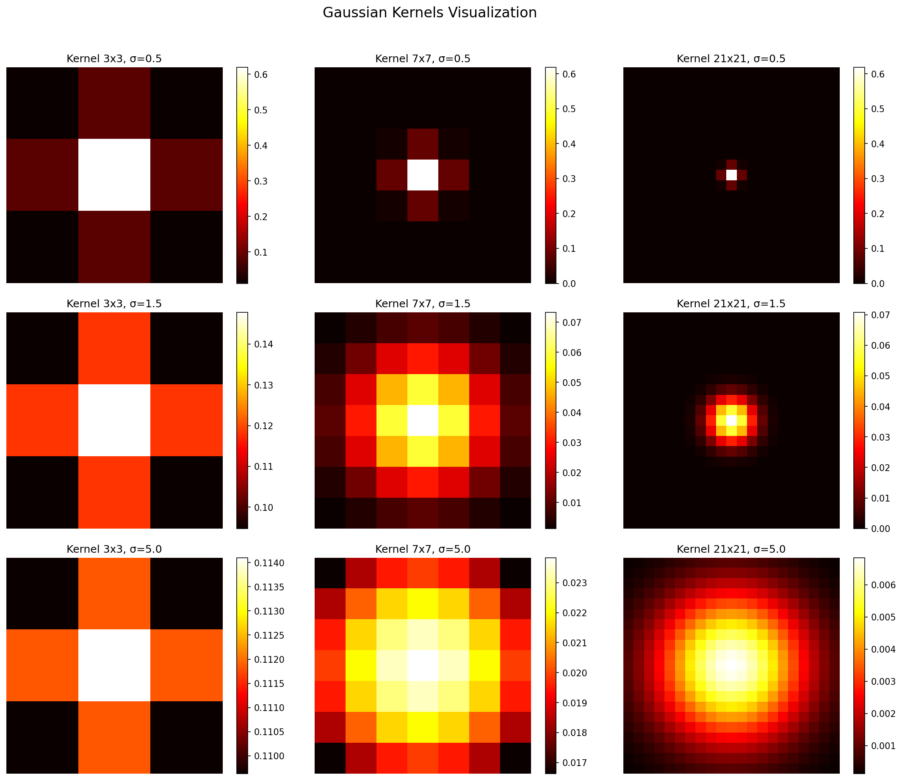
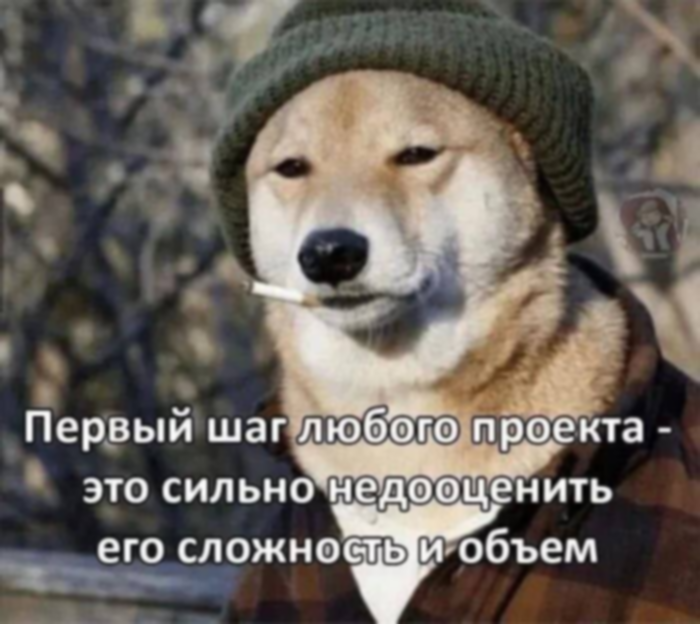

# Задание

Научиться реализовывать один из простых алгоритмов обработки изображений.
1. Реализовать алгоритм в 2 вариантах: 
— с использованием встроенных функций какой-либо библиотеки (OpenCV, PIL и др.)
— нативно на Python или C++
2. Сравнить быстродействие реализованных вариантов.
3. Сделать отчёт в виде readme на GitHub, там же должен быть выложен исходный код.

# 1. Теоретическая база
## 1.1 Гауссов фильтр
Гауссов фильтр — это линейный фильтр, используемый для сглаживания (размытия) изображений с целью подавления шума и уменьшения детализации. Он основан на свёртке исходного изображения с ядром, задаваемым двумерной функцией нормального распределения:



где:

x, y — координаты относительно центра ядра.

σ — стандартное отклонение (радиус размытия).

На практике коэффициент нормировки часто опускается, так как ядро нормализуется после вычисления, чтобы сумма всех его элементов равнялась единице. Это гарантирует сохранение общей яркости изображения после фильтрации.

## 1.2 Параметры фильтра
Размер ядра — нечётное целое число k∈{3,5,7…}, определяющее окно локальной области, участвующей в вычислении нового значения пикселя.

Стандартное отклонение σ — управляет шириной гауссианы: при малых σ фильтр слабо размывает, при больших — сильнее усредняет окрестность.

## 1.3 Свёртка изображения с ядром
Для каждого пикселя (i,j) выходного изображения выполняется взвешенная сумма значений пикселей в окне размером k×k:

```
I_out(i, j) = Σ Σ I_padded(i + u, j + v) * G(u - c, v - c)
              u=0 to k-1, v=0 to k-1
```

где:

k — размер ядра (нечётное целое число)

c = k // 2 — смещение к центру ядра

I_padded — изображение с добавленными границами

G — нормализованное гауссово ядро.

# 2. Описание разработанной системы


## 2.1 Реализованные методы
Разработаны два варианта применения Гауссова фильтра:

1) Нативная реализация (Pure Python + NumPy)

Генерация ядра: реализована вручную с использованием циклов и экспоненциальной функции.

Нормализация ядра: сумма элементов ядра приводится к 1.

Обработка границ: применяется np.pad(..., mode='reflect') для минимизации артефактов.

Свёртка: выполняется тройным вложенным циклом (по строкам, столбцам и каналам).
Поддержка как grayscale, так и RGB изображений.

2) Реализация с помощью OpenCV

Используется:
cv2.GaussianBlur(image, (kernel_size, kernel_size), sigma)

OpenCV автоматически обрабатывает многоканальные изображения и оптимизирует вычисления на уровне C++ и SIMD-инструкций.
Параметры ядра (ksize, sigma) задаются вручную, что обеспечивает честное сравнение с нативной версией.

## 2.2 Архитектура системы
Файл, filter.py содержит:

метод генерации ядра (create_gaussian_kernel)

функция свёртки (convolve2d_numpy)

нативный фильтр (gaussian_filter_numpy)

обёртку над OpenCV (gaussian_filter_opencv)


# 3. Результаты тестирования
## 3.1 Проверка зависимости между размером ядра и значением σ

Значения σ = [0.5, 1.5, 5.0]
Размеры ядра = [(3, 3), (7, 7), (21, 21)]



**По строкам (фиксированная sigma):**
Когда ядро слишком мало для sigma — обрезанная гауссова кривая

Когда ядро слишком велико — много нулевых значений на краях

**По столбцам (фиксированный размер):**
Как sigma меняет "крутизну" градиента

Маленькая sigma — резкий пик кривой, быстрое убывание

Большая sigma — пологий пик кривой, медленное убывание

**Диагональ (пропорциональное изменение):**
Оптимальные сочетания, где ядро идеально охватывает гауссову кривую

**Вывод**
Маленькое ядро + большая sigma = артефакты (ядра обрезаны)

Большое ядро + маленькая sigma = неэффективно (много нулей)

Оптимальное соотношение — плавный переход от центра к краям без резких обрезаний

## 3.2 Сравнение различных оптимальных сочетаний параметров





## 3.2 Сравнение производительности

Kernel: 7x7, Sigma: 1.5
============================================================
Method               Color (ms)      Gray (ms)      
------------------------------------------------------------
OpenCV               1.195           0.514          
NumPy                6524.472        4760.046       
------------------------------------------------------------
Speedup (NumPy/OpenCV) 5457.8         x 9255.4        x
============================================================

* Нативная реализация работает корректно, но крайне медленно.
* OpenCV быстрее в тысячи раз.
* Основное ускорение достигается за счёт C++-оптимизаций и SIMD.
* Работа демонстрирует важность использования специализированных библиотек.

